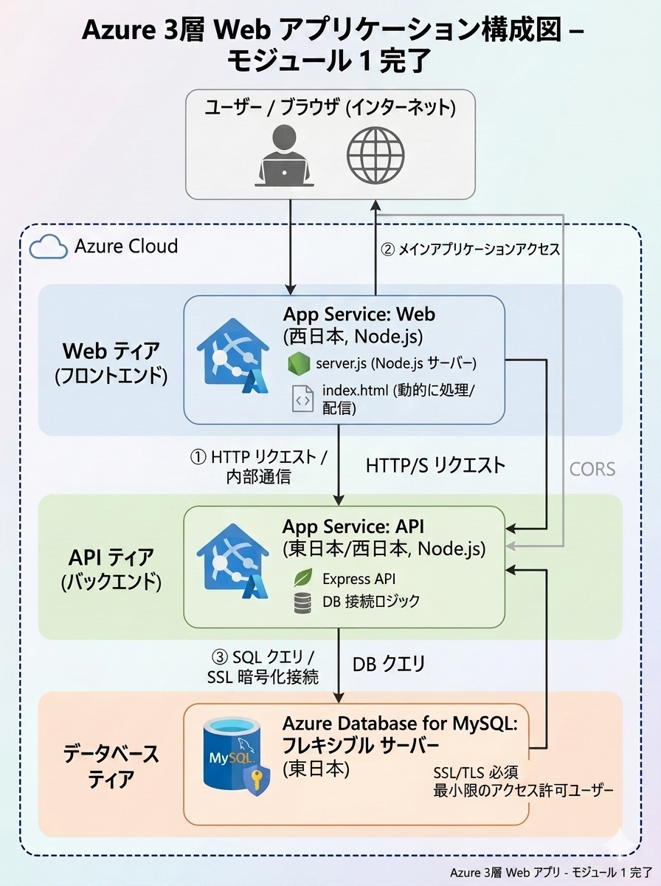
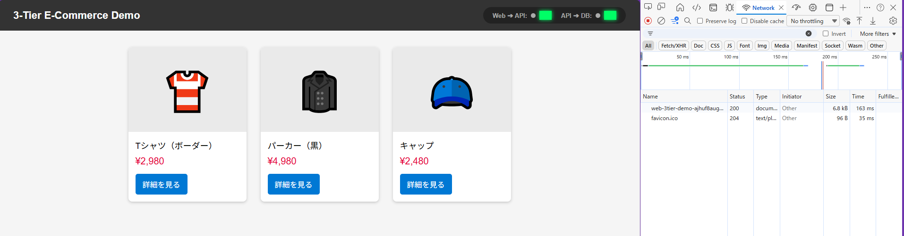
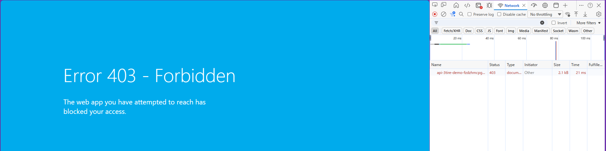
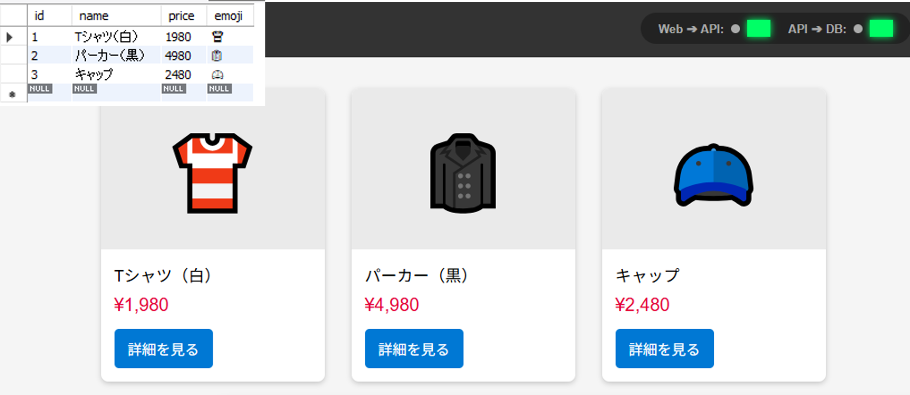
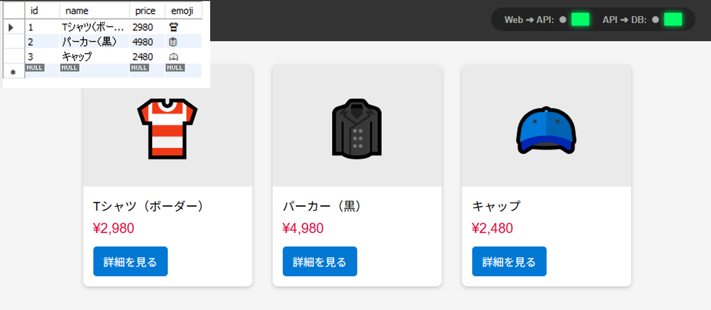

#  【最終提出用】Azure 3層Webアプリケーション インフラ構築実績（Module 1 完了版）

## 1. 概要（Overview）
Node.js（Web）× Node.js（API）× MySQL（DB）によるクラウドネイティブな 3 層アプリケーション基盤を Azure 上に構築。
Web 層は独自の Node.js サーバー（server.js）を App Service 上で稼働させ、API 層（Node.js）および MySQL Flexible Server と連携し、Web → API → DB の疎通までを完了。実務レベルの構築・検証プロセスを再現しました。

## 2. 技術スタック（Tech Stack）
- **Web層**：Azure App Service（Linux / Node.js）
  - 独自 Node.js サーバー（server.js）
  - index.html を動的に加工して返却
  - API 疎通テスト機能を内蔵
  - pm2 による常駐起動
- **API層**：Azure App Service（Linux / Node.js）
  - Express ベース of API
  - DB 接続処理を担当
  - CORS 設定でブラウザからのアクセスを許可
- **DB層**：Azure Database for MySQL – Flexible Server
  - SSL/TLS 必須
  - 最小権限ユーザーで運用
  - Firewall による接続元制限

###  Azure 3層Webアプリケーション構成図

## 3. WBS に基づくタスク実行実績（Execution Based on WBS）
実務を想定し、要件からタスクを分解（WBS化）。スプリント計画に沿って Module 1 を完了。

### ■ Jiraスプリントタスク完了実績

---

### ✔ Web → API 結合（2種類の通信の役割を明確化）
本構成では Web 層（Node.js）と API 層（Node.js）が別 App Service のため、以下の 2種類の通信 が発生する。

#### ① Web層 Node.js（server.js）→ API（サーバー間通信）
- **目的**：Web 層が API の稼働状況を確認する疎通テスト。API が返す特定文字（`API_SUCCESS_OK`）を検証し、結果を `index.html` に動的に埋め込み、通知バーとして表示。
- **特徴**：サーバー間通信のため CORS 不要。API や DB が落ちていても Web 画面は正常表示され、その代わり、通知バーに「API疎通失敗」「DB疎通なし」などのメッセージを返せる。

#### ② ブラウザ → API（本番通信）
- **目的**：画面に DB のデータを表示するための本番 API 呼び出し。
- **特徴**：Web と API が別ドメインのため CORS が必要。API → DB が失敗している場合、画面にデータは表示されない。

 **この 2 種類の通信により、“Web 画面は正常に表示されるが、DB の結果だけ表示されない” といった状態を正しく検知・表示できる構成となっている。**

---

- **✔ Web 基盤構築（Node.js Web サーバー）**
  - App Service（Web）作成、Japan West のクォータ制限を回避
  - `server.js` / `index.html` をデプロイ、pm2 による Node.js 常駐起動
  - ブラウザでの動作確認（HTTP 200 / 動的 HTML 生成）
- **✔ API 基盤構築**
  - App Service（API）作成（Web と同一プランでコスト最適化）
  - CORS 設定で Web → API の通信を許可、Node.js ランタイムの起動検証（pm2 / Oryx）
- **✔ DB 基盤構築**
  - MySQL Flexible Server 作成（Japan East）、Firewall による接続元制限、最小権限ユーザー作成
  - SSL/TLS 必須設定に対応（`rejectUnauthorized: false`）
- **✔ Web → API 結合**
  - 環境変数（`API_URL`）で API エンドポイントを安全に管理
  - Web 層の `server.js` から API へ疎通テスト（http/https リクエスト）を実行し、レスポンス内容を Web 画面に動的表示
- **✔ API → DB 結合**
  - Connection String を App Service の環境変数に安全に配置
  - SELECT クエリの実行成功、API → DB → API の往復通信を確認

## 4. 課題解決（Troubleshooting 実績）

### 事象①：デプロイしても画面が真っ白のまま切り替わらない（Azureのキャッシュの罠）

- **原因**：
  初めてデプロイした際、Azureの初期画面が残ったままになっていました。その後、直そうとして何度も上書きデプロイを繰り返すうちに、サーバー（Kudu）の内部に古いビルドキャッシュやゴミデータが溜まってしまい、新しくアップロードしたファイルが正常に反映されず、404エラーやアプリエラーが連発していました。また、Node.js（server.js）側でHTMLファイルをブラウザに送る仕組み（ルーティング）の書き方にも考慮漏れがありました。
- **対策**：
  ブラウザのデベロッパーツール（Networkタブ）で実際の動きを追跡。原因がコードではなく環境側にあると推測し、Kuduの管理画面からSSHコンソールに入り、`/home/site/wwwroot` の中にある古いキャッシュフォルダを一度思い切って丸ごと削除してリセットしました。あわせて `server.js` のファイル配信コードを正しく書き直し、再デプロイすることで無事に画面を表示させました。
- **学んだこと・強み**：
  不具合が起きたときに、ただ「何度もデプロイし直す」だけではなく、サーバーの裏側（管理画面）まで見に行って原因を探る粘り強さがあります。「インフラの環境のせい」なのか「自分が書いたコードのせい」なのかを、一つずつ切り分けてパニックにならずに解決する自走力が身につきました。

### 事象②：MySQLデータベースへの接続エラー（安全に繋ぐためのお作法）

- **原因**：
  AzureのMySQLデータベースは、セキュリティの初期設定で「暗号化（SSL）されていない通信はすべてシャットアウトする」という厳しいガードがかかっていたため、アプリからの接続が弾かれていました。
- **対策**：
  エラーを回避するためにデータベース側の安全設定をOFFにしてしまうのではなく、公式ドキュメントを調べて「アプリ側をデータベースの安全基準に合わせる」のが正しいと判断。Node.js（mysql2）の接続設定の中に、強制的にSSLを認識させて通信を暗号化するオプション（`ssl: { rejectUnauthorized: true }`）を書き加えることで、安全に接続を通しました。
- **学んだこと・強み**：
  安全性を犠牲にするような応急処置（ワークアラウンド）に逃げず、クラウドの公式ルールに則った正しい設定で根本解決を目指す堅実さがあります。ドキュメントを読んで必要な設定をサッとコードに反映させることができます。

### 事象③：画面は映るのに、中身のデータが空っぽになる（非同期の先走りバグ）

- **原因**：
  Node.js（server.js）の中で、HTMLファイルを読み込む処理の書き方が悪かったためです。JavaScript特有の「処理の完了を待たずに次へ進んでしまう（非同期）」という性質のせいで、ファイルの読み込みが終わる前に、Node.jsが先走って空っぽの画面をブラウザに返してしまっていました。
- **対策**：
  「ちゃんと読み込みが終わるまで待て」と指示するために、コードを `fs.promises.readFile` に変更し、その前に `await` を書き足すリファクタリングを行いました。これにより、データが100%準備できてから画面を返す正しい順番に制御し、無事にデータが映るようになりました。
- **学んだこと・強み**：
  Node.js/JavaScriptで一番つまずきやすい「非同期処理（処理の順番待ち）」の仕組みを、実際のデバッグを通して深く理解できました。画面が出ない原因が、ネットワークの繋がりが悪いせいなのか、自分のコードの順番が狂っているせいなのかをロジカルに見分けることができます。

### 事象④：WebとAPIの間で通信がブロックされる（CORSエラー）

- **原因**：
  今回はWeb用のサーバーとAPI用のサーバーを別々のURL（別App Service）で動かしていたため、ブラウザのセキュリティ機能（同一オリジンポリシー）に引っかかり、「違うURL同士の通信は怪しいのでブロックします」と通信を止められていました。
- **対策**：
  コードを修正するのではなく、AzureポータルからAPI側の管理画面を開き、「CORS設定」のメニューにWeb側のURLをホワイトリストとして登録しました。これにより、API側が「このWebサイトからの通信は安全だよ」とブラウザに証明できるようになり、エラーを解決しました。
- **学んだこと・強み**：
  複数のサーバーに分かれた構成（3層構造）だからこそ起きるブラウザ特有のセキュリティエラーに直面し、クラウド（PaaS）の標準設定を使ってパッとスマートに解決する引き出しが増えました。

### 事象⑤：APIからデータベースへ繋ぐときに時間切れになる（タイムアウトエラー）

- **原因**：
  MySQLデータベース側のIPファイアウォール（防御壁）の制限により、同じAzureの仲間であるはずのAPIサーバーからのアクセスが、初期状態では不審者扱いされて弾かれていたため、通信が時間切れ（タイムアウト）になっていました。
- **対策**：
  AzureポータルでMySQLのネットワーク設定を開き、「Azure内の任意のサービスからのアクセスを許可する」というチェックボックスを有効化しました。これにより、同じAzure内部での安全な通信ルートが開通しました。
- **学んだこと・強み**：
  コードが間違っていないのに動かない原因が、インフラ（ファイアウォール）の壁にあると素早く気づくことができました。すべての通信設定が終わり、画面のランプが全部グリーン（🟢）に点灯した瞬間は、インフラとアプリが1つに繋がった大きな達成感を得られました。

## 5. Module 1 の成果（Result）
- Azure 上に 3 層構造（Web / API / DB）の基盤を構築
- Web（Node.js）→ API（Node.js）→ DB（MySQL Flexible Server）の疎通を SSL/TLS で実現
- Web 層で API のレスポンスを動的に表示する仕組みを構築
- デプロイ後の動作差異に対して、ログ解析・設定見直しを通じて問題を解決

## 6. Module 1 完了エビデンス

### ① 外部アクセスからWebブラウザ閲覧

- **エンドツーエンドの疎通検証ロジック**：
  1. **Web ➔ API の疎通確認**：Web層のNode.jsサーバー（server.js）からAPIのエンドポイントへサーバー間通信を実行。APIから応答が返ってきた時点で、Web層がHTML内の「Web ➔ API」ステータスを🟢（有効）に加工。
  2. **API ➔ DB のSSL/TLS結合確認**：API内部でAzureの環境変数を検証後、`ssl: { rejectUnauthorized: true }` を有効化した状態でMySQL Flexible Serverへセキュアに接続。
  3. **データ取得による結合証明**：APIがDBから `SELECT` クエリで商品データを動的に取得し、成功ステータス（`status: "API_SUCCESS_OK"`）を返却。Web層のサーバー（server.js）がこのレスポンス内容をフックし、フロントエンド（React）画面の「API ➔ DB」ランプを🟢（有効）に動的変換した上でブラウザへ画面を返却しています。

### ② APIのWebAppは外部からの接続を拒否設定

- **セキュリティ担保の証明**：API側のApp Serviceへの直接アクセスを遮断し、セキュリティ上フロントのWeb層だけアクセスが可能となっている状態を担保。

### ③ Web 画面に DB のデータの反映

- **データ連動の証明**：MySQL内のレコード値を変更し、それがAPIを経由してWeb画面にリアルタイムかつ動的に反映されることを確認済みです。
