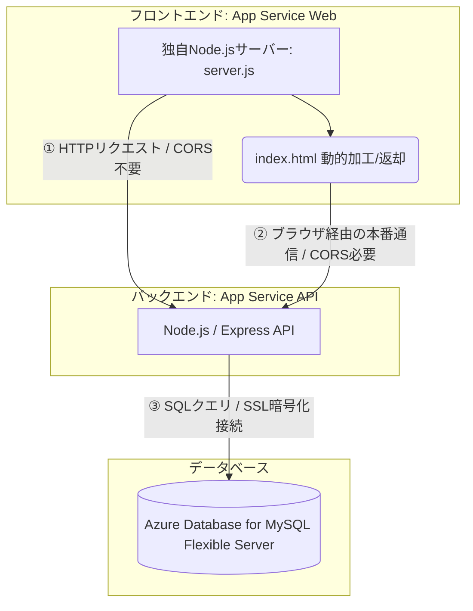
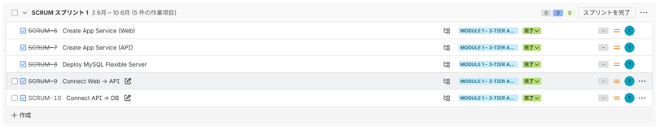

# 🌐 【最終提出用】Azure 3層Webアプリケーション インフラ構築実績（Module 1 完了版）

## 1. 概要（Overview）
Node.js（Web）× Node.js（API）× MySQL（DB）によるクラウドネイティブな 3 層アプリケーション基盤を Azure 上に構築。
Web 層は独自の Node.js サーバー（server.js）を App Service 上で稼働させ、API 層（Node.js）および MySQL Flexible Server と連携し、Web → API → DB の疎通までを完了。実務レベルの構築・検証プロセスを再現しました。

## 2. 技術スタック（Tech Stack）
- **Web層**：Azure App Service（Linux / Node.js）
  - 独自 Node.js サーバー（server.js）
  - index.html を動的に加工して返却
  - API 疎通テスト機能を内蔵
  - pm2 による常駐起動
- **API層**：Azure App Service（Linux / Node.js）
  - Express ベース of API
  - DB 接続処理を担当
  - CORS 設定でブラウザからのアクセスを許可
- **DB層**：Azure Database for MySQL – Flexible Server
  - SSL/TLS 必須
  - 最小権限ユーザーで運用
  - Firewall による接続元制限

###  Azure 3層Webアプリケーション構成図

## 3. WBS に基づくタスク実行実績（Execution Based on WBS）
実務を想定し、要件からタスクを分解（WBS化）。スプリント計画に沿って Module 1 を完了。

### ■ Jiraスプリントタスク完了実績

---

### ✔ Web → API 結合（2種類の通信の役割を明確化）
本構成では Web 層（Node.js）と API 層（Node.js）が別 App Service のため、以下の 2種類の通信 が発生する。

#### ① Web層 Node.js（server.js）→ API（サーバー間通信）
- **目的**：Web 層が API の稼働状況を確認する疎通テスト。API が返す特定文字（`API_SUCCESS_OK`）を検証し、結果を `index.html` に動的に埋め込み、通知バーとして表示。
- **特徴**：サーバー間通信のため CORS 不要。API や DB が落ちていても Web 画面は正常表示され、その代わり、通知バーに「API疎通失敗」「DB疎通なし」などのメッセージを返せる。

#### ② ブラウザ → API（本番通信）
- **目的**：画面に DB のデータを表示するための本番 API 呼び出し。
- **特徴**：Web と API が別ドメインのため CORS が必要。API → DB が失敗している場合、画面にデータは表示されない。

👉 **この 2 種類の通信により、“Web 画面は正常に表示されるが、DB の結果だけ表示されない” といった状態を正しく検知・表示できる構成となっている。**

---

- **✔ Web 基盤構築（Node.js Web サーバー）**
  - App Service（Web）作成、Japan West のクォータ制限を回避
  - `server.js` / `index.html` をデプロイ、pm2 による Node.js 常駐起動
  - ブラウザでの動作確認（HTTP 200 / 動的 HTML 生成）
- **✔ API 基盤構築**
  - App Service（API）作成（Web と同一プランでコスト最適化）
  - CORS 設定で Web → API の通信を許可、Node.js ランタイムの起動検証（pm2 / Oryx）
- **✔ DB 基盤構築**
  - MySQL Flexible Server 作成（Japan East）、Firewall による接続元制限、最小権限ユーザー作成
  - SSL/TLS 必須設定に対応（`rejectUnauthorized: false`）
- **✔ Web → API 結合**
  - 環境変数（`API_URL`）で API エンドポイントを安全に管理
  - Web 層の `server.js` から API へ疎通テスト（http/https リクエスト）を実行し、レスポンス内容を Web 画面に動的表示
- **✔ API → DB 結合**
  - Connection String を App Service の環境変数に安全に配置
  - SELECT クエリの実行成功、API → DB → API の往復通信を確認

## 4. 課題解決（Troubleshooting 実績）

### 事象①：HTTP 200 が返るのに画面が真っ白で動かない（App Serviceの罠）
- **原因**：App Service のフォールバック動作（`hostingstart.html`）が発動し、Node.js アプリのプロセスが起動していないにもかかわらず、表面上は 200 OK を返していた。
- **対策**：DevTools の Network タブでレスポンスの本体を確認。Kudu/SSH 経由で内部コンソールへ入り、`node_modules` の不足を特定。`npm install` および `pm2` でプロセスを明示的に立ち上げて復旧。
- **強み**：表面的なステータスコードに依存せず、インフラとアプリの境界を理解した上で論理的に切り分けできる。

### 事象②：MySQL が SSL 必須設定により接続を拒否（セキュリティ要件）
- **原因**：MySQL Flexible Server 側の初期セキュリティ要件（`require_secure_transport=ON`）により、非暗号化の接続試行がすべて遮断されていた。
- **対策**：Node.js（mysql2）の接続時オプションに `ssl: { rejectUnauthorized: true }` を追加し、クラウド特有のセキュリティ要件に準拠したセキュアなコードへと修正。
- **強み**：インフラ側の求める暗号化要件を理解し、セキュアなアプリケーションの実装コードに落とし込める。

### 事象③：非同期処理の順序問題により画面へデータが反映されない
- **原因**：API（Node.js）内部で非同期処理（`fs.readFile`等）のハンドリングが不適切であり、DB からのデータ取得が完了する前に、空の状態の HTML やレスポンスを返却していた。
- **対策**：`fs.promises.readFile` ＋ `await` による非同期制御へのリファクタリングを実施し、プログラムの実行順序を厳密に制御。
- **強み**：アプリコードのバグと、インフラのデータ疎通不良を切り分けてボトルネックを特定できる。

### 事象④：Web ➔ API 連携時の CORS 接続エラー
- **原因**：Web と API がそれぞれ異なる App Service（異なるURL）で稼働しているため、ブラウザの同一オリジンポリシーによってクロスオリジン通信がブロックされた。
- **対策**：API 側の App Service の CORS 設定メニューより、Web 側のフロントエンドURLを明示的にホワイトリストに登録して解決。

### 事象⑤：API ➔ DB 結合時の接続タイムアウトエラー
- **原因**：MySQL 側の IP ファイアウォール制限により、App Service（API）の動的アウトバウンド IP からのアクセスが初期設定で弾かれていた。
- **対策**：MySQL のネットワーク構成にて「Azure 内の任意のサービスからのアクセスを許可する」のチェックを有効化し、クラウド内のセキュアな通信を許可。

## 5. Module 1 の成果（Result）
- Azure 上に 3 層構造（Web / API / DB）の基盤を構築
- Web（Node.js）→ API（Node.js）→ DB（MySQL Flexible Server）の疎通を SSL/TLS で実現
- Web 層で API のレスポンスを動的に表示する仕組みを構築
- デプロイ後の動作差異に対して、ログ解析・設定見直しを通じて問題を解決

## 6. Module 1 完了エビデンス

### ① 外部アクセスからWebブラウザ閲覧

- **エンドツーエンドの疎通検証ロジック**：
  1. **Web ➔ API の疎通確認**：Web層のNode.jsサーバー（server.js）からAPIのエンドポイントへサーバー間通信を実行。APIから応答が返ってきた時点で、Web層がHTML内の「Web ➔ API」ステータスを🟢（有効）に加工。
  2. **API ➔ DB のSSL/TLS結合確認**：API内部でAzureの環境変数を検証後、`ssl: { rejectUnauthorized: true }` を有効化した状態でMySQL Flexible Serverへセキュアに接続。
  3. **データ取得による結合証明**：APIがDBから `SELECT` クエリで商品データを動的に取得し、成功ステータス（`status: "API_SUCCESS_OK"`）を返却。Web層のサーバー（server.js）がこのレスポンス内容をフックし、フロントエンド（React）画面の「API ➔ DB」ランプを🟢（有効）に動的変換した上でブラウザへ画面を返却しています。

### ② APIのWebAppは外部からの接続を拒否設定

- **セキュリティ担保の証明**：API側のApp Serviceへの直接アクセスを遮断し、セキュリティ上フロントのWeb層だけアクセスが可能となっている状態を担保。

### ③ Web 画面に DB のデータの反映

- **データ連動の証明**：MySQL内のレコード値を変更し、それがAPIを経由してWeb画面にリアルタイムかつ動的に反映されることを確認済みです。
