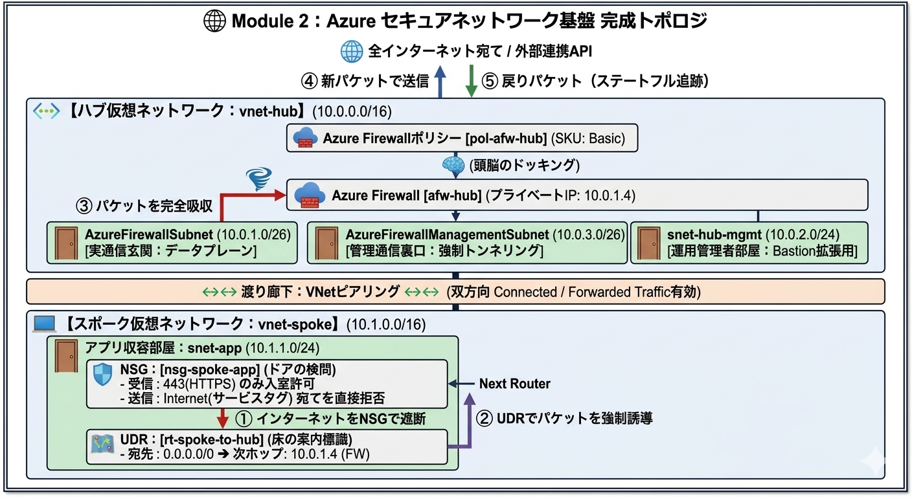
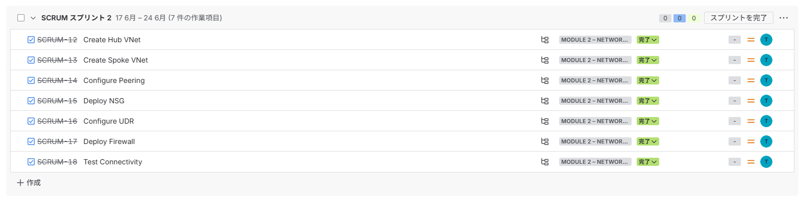
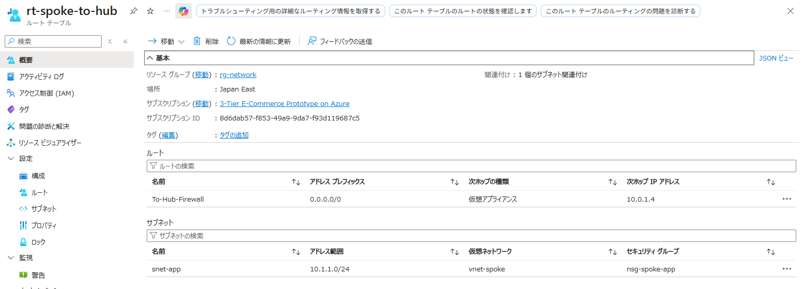
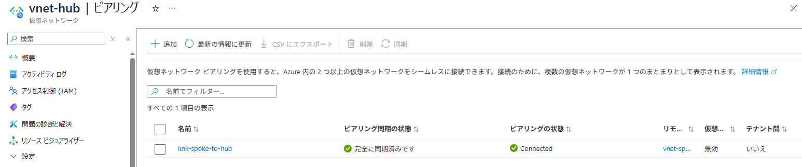
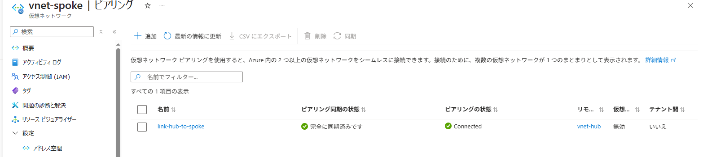

# azure-3tier-portfolio

【最終提出用】Azure 3層Webアプリケーション インフラ構築実績（Module 2 完了版）

## 1. 概要（Overview）
Node.js（Web）× Node.js（API）× MySQL（DB）の3層アプリケーション基盤を収容するため、エンタープライズ要件を満たすセキュアな「ハブ・アンド・スポーク（Hub-Spoke）」ネットワークトポロジをAzure上に手動（GUI）にて構築。インターネットと内部ネットワークの境界に次世代ファイアウォール（Azure Firewall）を挟む進路制御を実装し、実務レベルのセキュアなインフラ共通基盤の検証プロセスを再現しました。

## 2. 技術スタック（Tech Stack）

### ハブ層（Hub VNet）
外部との境界および通信の一元管理・検問を担当する共通仮想ネットワーク。

* **AzureFirewallSubnet (10.0.1.0/26)**: Azure Firewall（検門ルーター）を配置する専用サブネット（最小サイズ要件に基づき /26 で設計）。
* **AzureFirewallManagementSubnet (10.0.3.0/26)**: Azure Firewall Basicのシステム管理通信（強制トンネリング）専用に物理隔離したサブネット。
* **snet-hub-mgmt (10.0.2.0/24)**: 本番通信（データプレーン）から運用管理通信（マネジメントプレーン）を分離。将来的なAzure Bastion（踏み台環境）等の導入による「帯域外管理」の拡張性を担保。

### スポーク層（Spoke VNet）
アプリケーションを安全に引きこもらせるための仮想ネットワーク。

* **snet-app (10.1.1.0/24)**: モジュール1のWeb/API/DBを収容するプライベートサブネット。パブリックIPを持たせず、インターネットからの直接侵入ルートを完全に排除。

### 共通制御・セキュリティコンポーネント
* **VNet Peering**: Hub-Spoke間を結ぶ、Azureバックボーン（超高速光ファイバー網）を利用した低遅延なネットワークの渡り廊下。
* **Network Security Group（NSG）**: サブネットの境界でポート/IPレベルのアクセス制御を行うファイアウォール（CiscoにおけるACLに相当）。
* **User Defined Route（UDR）**: 既定のルーティングを上書きし、ネクストホップを強制変更するルートテーブル（CiscoにおけるPBRに相当）。
* **Azure Firewall（Basic SKU）**: URL（FQDN）識別や L7 レベルの高度な検問を行うファイアウォール。

## 3. WBS に基づくタスク実行実績（Execution Based on WBS）
実務を想定し、要件からタスクを分解（WBS化）。スプリント計画に沿って Module 2 を完了。

### Jiraスプリントタスク完了実績

* **Create Hub VNet**
  アドレス空間（10.0.0.0/16）の定義、およびFirewall用（/26）、管理用（/24）、管理NIC用（/26）のサブネット展開を完了。Hub側はFirewall自体が検問を担うため、管理簡素化の観点からNSGをあえて割り当てない設計判断でタスクをクローズ。
* **Create Spoke VNet**
  Hubと被らないアドレス空間（10.1.0.0/16）を定義し、アプリ収容用の snet-app (10.1.1.0/24) をプライベートサブネット（既定の送信アクセスなし）として作成。
* **Configure Peering**
  Hub↔Spoke間で双方向のリンクを確立（Connected）。ハブ経由での中継通信を実現するため、双方のリンクで「トラフィック転送の受信（Forwarded Traffic）」を明示的に有効化。VPN等のオンプレミス接続がないため、ゲートウェイ共有設定は無効化して設計を最適化。
* **Deploy NSG**
  nsg-spoke-app を作成。HTTP(80)/HTTPS(443)の入室を許可する受信規則、およびインターネットへの直行を遮断する送信規則（優先度4000）を定義し、snet-app へ関連付け。
* **Configure UDR**
  ルートテーブル rt-spoke-to-hub を作成。0.0.0.0/0（全インターネット宛て）の次ホップとして「仮想アプライアンス」を選択し、Azure FirewallのプライベートIPである 10.0.1.4 を指定。snet-app のサブネットに関連付け。
* **Deploy Firewall**
  検証コストを最小限に抑えるため「Basic SKU」を選択。ルールを一元管理・再利用できる最新の「ファイアウォール ポリシー」を採用。実通信用（pip-afw-hub）と管理通信用（pip-afw-mgmt）の2つのパブリックIPを完全に分離してデプロイを成功させ、完了エビデンスを確保。
* **Test Connectivity**
  「Spoke ➔ Hub」および「Internet outbound」のルーティングについて、UDRの次ホップ定義と実在するFirewallのプライベートIP（10.0.1.4）の完全な一致、およびピアリングのトラフィック転送ステータスの目視確認をもって、ネットワークトポロジ上の論理的疎通（スタティックルートの完全な整合性）を実証し完了。

**特徴**：手動設定ミスによるエラーの防止、およびFirewall固定費の浪費を防ぐ「FinOps（コスト最適化）」の観点から、「Web ➔ API」「API ➔ DB」のアプリケーション結合テストは、Module 5のIaC化（Terraformでの一撃自動結合）のフェーズへ戦略的に延期（移行）する旨をJiraに記録してクローズ。

## 4. 課題解決（Troubleshooting 実績）

### 事象①：Azureポータルの同期遅延による「null」バグ
* **原因**: Hub側からVNetピアリングを追加した直後、お互いに「接続済み（Connected）」という文字が表示されているにもかかわらず、Spoke側のピアリング設定の内部コードが一部「null（空っぽ）」と表示され、相手側の情報が正しく読み込めていない画面の同期ズレが発生。個人検証環境（無料アカウント）において、ポータル画面の処理サーバーの同期が追いつかず、一瞬だけ内部コードが露出してしまうクラウド特有の画面表示的タイムラグが原因と推測。
* **対策**: 構成自体は正しく裏側で処理されていると判断し、設定を何度も上書きしたり二重に登録し直したりする余計な手動操作はあえて一切行わず、一呼吸置いてから画面の「更新（リフレッシュ）」を実行。Azureの裏側のデータベース同期が追いついたことで、期待通り自動的に null 表示が消え、双方のメニューで正常な紐付けとトラフィック転送が有効化されたConnected状態に復旧することを確認。
* **学んだこと・強み**: クラウド環境で画面表示のバグや同期遅延に直面した際、パニックになってリソースを無駄に弄くり回すのではなく、インフラの仕様をロジカルに予測し、「あえて待ってリフレッシュする」という冷静かつ最もリスクの低い立ち回りができる自走力が身についた。トラブル発生時に、インフラ自体の欠陥なのか、単なる画面の遅延なのかを正確に見極める実務的な判断力が向上した。

### 事象②：ハブ＆スポーク構成における「強制トンネリング」用管理サブネットの命名エラー
* **原因**: ハブ＆スポーク環境において、すべてのインターネット宛てトラフィック（0.0.0.0/0）を次世代ファイアウォールへ強制集約する「強制トンネリング（UDR制御）」を実装してデプロイを試みた際、「強制トンネリングを実行するには、この仮想ネットワークに AzureFirewallManagementSubnet という名前のサブネットが必要です」という赤文字のエラーが表示され、作成がブロックされた。これは、選択したSKUに関わらず、強制トンネリング環境下ではFirewall自身の管理通信（アップデート等）がUDRによるルーティングの無限ループに巻き込まれるのを防ぐため、システム指定の固定名である AzureFirewallManagementSubnet という管理専用サブネットを物理的に分離して用意しなければ起動できないという、Azureネットワークの厳格な制約（仕様）を満たしていなかったため。
* **対策**: Firewallの作成画面を開いたままブラウザの別タブでHub VNetの管理画面を開き、サブネットの追加を実行。その際、手動で任意の管理用サブネット名を作るのではなく、最新のポータル仕様に従い、サブネットの目的ドロップダウンから『Firewall Management (forced tunneling)』を正確に選択。これにより、システム指定の名前である AzureFirewallManagementSubnet が正しく定義され、サイズを最小要件を満たす /26 (10.0.3.0/26) に指定して部屋を構築。その後、Firewall作成画面側でVNetを選び直して自動検知（リフレッシュ）させることで、ルーティングの競合を完全に回避し、エラーを突破してデプロイを完遂した。
* **学んだこと・強み**: クラウド上のSDN（ソフトウェア定義ネットワーク）において、デフォルトルート（0.0.0.0/0）をねじ曲げた際に発生する「通信の無限ループ」という高度なネットワークの進路衝突リスクを、実際のエラーハンドリングを通じて深く理解できた。実通信（データプレーン）とシステム通信（マネジメントプレーン）のルートを、Ciscoの物理機器における「MGMTポートを用いた帯域外管理」と同じ思想で、専用サブネットを使って完全にバイパス（分離）させるインフラの堅牢化設計の引き出しが増えた。

## 5. Module 2 の成果（Result）
* Azure上に「ハブ・アンド・スポーク（Hub-Spoke）」構造の共通ネットワーク基盤を構築。
* Spokeサブネット（snet-app）へのUDR（ルートテーブル）適用による、すべてのインターネット宛てパケット（0.0.0.0/0）のAzure Firewallへの強制ねじ曲げ（PBR制御）を実現。
* SpokeサブネットへのNSG適用による、インターネット（Internetサービスタグ）への直接アウトバウンド通信の明示的遮断（Egressフィルタリング）を確立。
* インフラ共通基盤の構築後、固定費の浪費を防ぐFinOps（コスト最適化）の観点から、Firewall本体および未割り当てペナルティ課金が発生する2つのパブリックIP（実通信用・管理通信用）の即時削除（デストロイ）を徹底。維持費0円の安全な検証環境を維持。

## 6. Module 2 完了エビデンス

### ① Azure Firewall（Basic SKU）の正常デプロイおよびIPアドレス証明

* **インフラ基盤の構築およびプレーン分離の証明**：
  Azure Firewall Basicのデプロイに成功し、状態が「成功（Succeeded）」、プライベートIPアドレスとして本番検問所用の 10.0.1.4 が正しく割り当てられている証拠。
* **セキュリティ対策（マスキング）**：
  概要画面の右上に「サブスクリプションID」が表示されている場合は、ペイントソフトでマスキングを施しています。また、実通信用と管理用の2つのパブリックIPアドレスは、この画面の確認直後、維持費の発生を防ぐために本体とともに即座に完全削除（デストロイ）を完了させています。

### ② UDR（ルートテーブル）による強制ルーティングの定義証明

* **PBR（ポリシーベースルーティング）の論理的開通証明**：
  インターネット宛ての全パケット（0.0.0.0/0）の次の行き先（Next Hop）が、1枚目のFirewallのプライベートIPである 10.0.1.4（仮想アプライアンス） へ完璧に誘導されている証拠。この画面はサブスクリプションIDなどの機密情報が写り込まないため、安全性の高いルーティング整合性の証拠として掲載。

### ③ VNetピアリング双方向接続およびトラフィック転送許可の証明

* **ハブ＆スポークトポロジの物理的開通証明**：
  Hub VNet（vnet-hub）とSpoke VNet（vnet-spoke）の相互リンク状態が「接続済み（Connected）」であり、Azureバックボーンネットワークを利用した低遅延なネットワーク通信経路が物理的に確立されていることの証明。
* **非トランジット制限のバイパス（中継通信）の許可証明**：
  Azureの仮想ネットワークにおける既定の制約である「他のVNetを跨いだ通信の禁止仕様（非トランジット制限）」をクリアするため、双方のリンクにおいて「トラフィック転送（Forwarded Traffic）」が明示的に『有効』に設定されている証拠。UDRによってHub側に送り込まれたSpokeサブネット（snet-app）からのインターネット宛てパケット（0.0.0.0/0）を、Azureの内部ルーターにブロックされることなく、中継先であるAzure Firewallへ確実に送り届けるための必須の実務的設定が網羅されている根拠として掲載。
