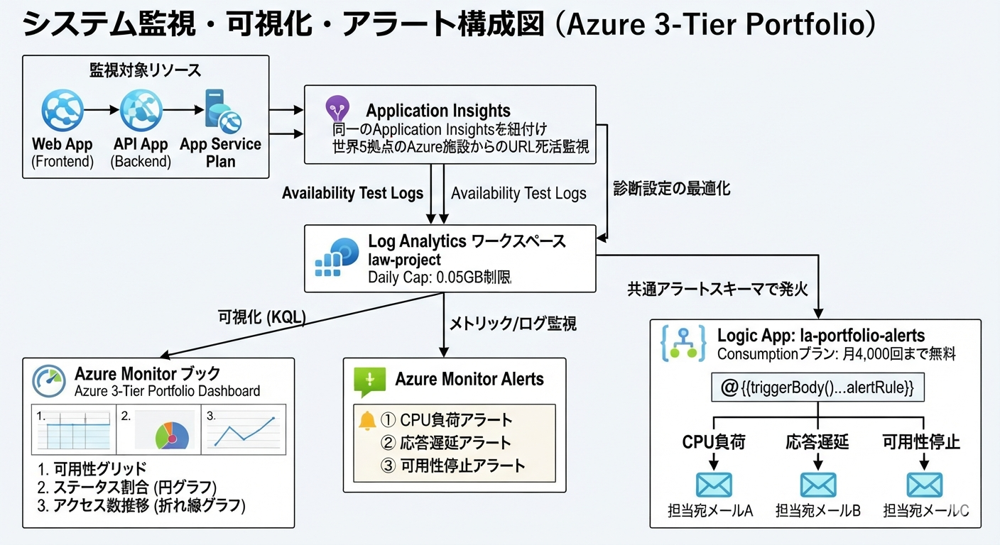
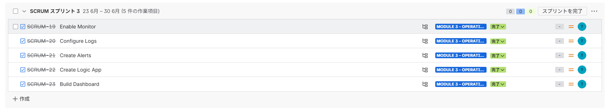
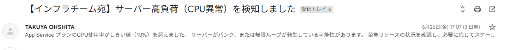
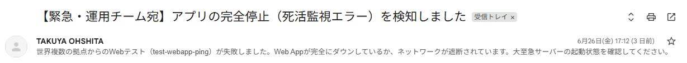
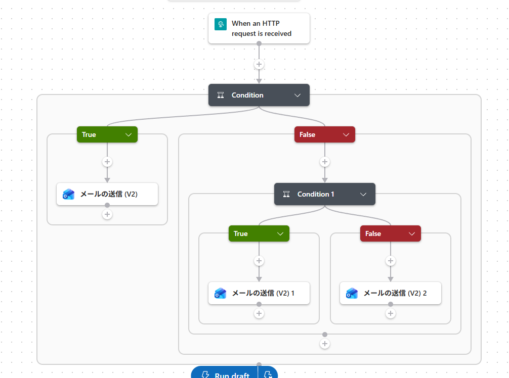
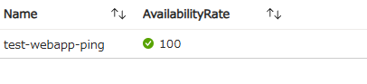
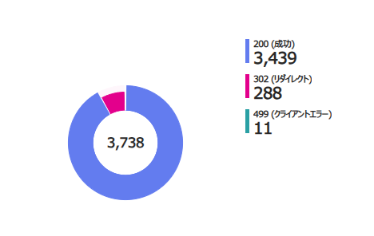
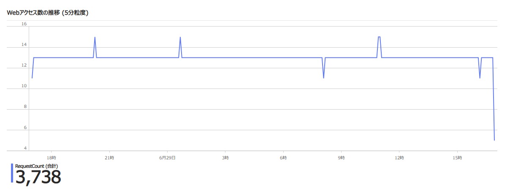

# 【最終提出用】Azure サーバーレス運用自動化および実務監視盤の構築実績（Module 3 完了版）

## 1. 概要と目的（Overview & Objectives）

本モジュールの目的は、構築した3層アプリケーション基盤（Web/API/DB）に対して、Azure MonitorおよびLogic Appsを組み合わせた監視・運用自動化環境（Operations Automation）を構築することです。
予算をほぼかけない検証環境を前提としつつ、実務に耐えうるアラート通知網と可視化ダッシュボードの構築を目指しました。

具体的には、以下の3点を目的としてタスクを実行しました。

- **コスト増加の抑制**: ログのインジェスト量を最小限に絞り込み、意図しない課金を防止する。
- **障害通知の自動選別**: 共通アラートスキーマを解読し、アラートの種類に応じて通知先や内容を自動ルーティングする。
- **運用の可視化**: 収集したログをもとに、システムの健康状態（可用性・アクセス推移・ステータス割合）を一目で確認できるダッシュボードを構築する。

---

## 2. 技術スタック（Tech Stack）

### 【構成図】Module 3: Operations Automation ＆ Monitoring Architecture

#### ■ システム連携イメージ（視覚的フロー）
<!-- 先ほど生成した日本語構成図の画像をリポジトリ内に配置し、パスを以下に指定してください -->


#### ■ データフロー詳細（構造化テキスト）
```text
[監視対象リソース]
  ├── Web App (Frontend)  ───┐ 同一のApplication Insightsを紐付け
  ├── API App (Backend)   ───┴──> [ Application Insights ]
  └── App Service Plan              │ (世界5拠点のAzure施設からのURL死活監視)
        │                           │
        │ 診断設定の最適化          │ 可用性テストログ
        └─(HTTP logs / Console)─┐  │
                                │  │
                                ▼  ▼
                   [ Log Analytics ワークスペース ]
                        (law-project)
                    Daily Cap: 0.05GB制限 (コスト爆発防止)
                        │           │
      ┌─────────────────┘           └─────────────────┐
      │  可視化 (KQL)                        │  メトリック/ログ監視
      ▼                                               ▼
[ Azure Monitor ブック ]                      [ Azure Monitor Alerts ]
 (Azure 3-Tier Portfolio Dashboard)                ├── ① CPU負荷アラート
  ├── 1. 可用性グリッド (Success)                  ├── ② 応答遅延アラート
  ├── 2. ステータス割合 (円グラフ)                 └── ③ 可用性停止アラート
  └── 3. アクセス数推移 (折れ線グラフ)                     │
                                                          │  共通アラートスキーマで発火
                                                          ▼
                                              [ Logic App: la-portfolio-alerts ]
                                               (Consumptionプラン: 月4,000回まで無料)
                                                          │
                                                          ▼ ネスト構造による条件分岐
                                               [ @{triggerBody()...alertRule} ]
                                                    ├── CPU負荷 ──> 担当宛メールA
                                                    ├── 応答遅延 ──> 担当宛メールB
                                                    └── 可用性停止 ──> 担当宛メールC

```

### 技術スタック詳細

#### 監視・データインジェスト層（Azure Monitor / LAW）
- **Log Analytics ワークスペース（law-project）**: すべてのログを集約する基盤。コスト抑制のため、Daily Cap（日次上限）を「0.05GB (50MB)」に制限。
- **Application Insights**: Web AppおよびAPI Appに同一のインスタンスを紐付け、アプリレイヤーの死活監視とパフォーマンスログを一元管理。
- **診断設定（Diagnostic Settings）**: コスト最適化のため、インフラメトリック転送をオフにし、実務に必須となる HTTP logs と AppServiceConsoleLogs のみをLAWへリアルタイム転送するよう設定。

#### アラート・自動選別ルーティング層（Logic Apps）
- **Logic App (la-portfolio-alerts)**: サーバーレスのマルチテナント（Consumption/従量課金）プランを採用（ログ分析はオフ）。
- **共通アラートスキーマ（Common Alert Schema）**: アラートの種別（CPU負荷、応答遅延、可用性停止）を動的に判別するため、式 `@{triggerBody()?['data']?['essentials']?['alertRule']}` を用いて JSON 解析を実装。
- **条件分岐（Condition/ネスト構造）**: 3つの障害ごとに件名と本文を動的に書き分け、適切なメールアドレスへ自動配送するルーティングを構築。

#### 視覚化・ダッシュボード層（Azure Workbooks）
- **Azure Monitor ブック (Azure 3-Tier Portfolio Dashboard)**: 追加料金のかからない無料のダッシュボード基盤。ポータルへのピン留めに対応。

---

## 3. Jira に基づくタスク実行実績（Execution Based on Tasks）



### ① Enable Monitor / Configure Logs
- **LAWのDaily Cap設定**: Log Analytics ワークスペースのデータインジェスト上限を「0.05GB/日（50MB）」に制限し、検証中の意図しない大量ログによる課金バグを設計レベルで防止。
- **診断設定の選別**: コスト削減のため、インフラメトリック（PerfやAzureMetricsなど）の転送を無効化。Web Appの HTTP logs と AppServiceConsoleLogs のみに絞り込んでLAWへリアルタイム転送するようフィルタリング。

### ② Create Alerts
- **CPU alert**: App Serviceプランを対象とした、静的判定によるCPU負荷アラートを設定（検証用。しきい値を低めに調整）。
- **Response time alert**: Web Appを対象とした、応答時間が0.1秒を超えた場合に検知する静的判定アラートを設定。
- **Availability alert**: Application Insightsの可用性テスト（URL死活監視）機能を使用し、世界複数拠点のAzure施設から5分間隔でWebサイトの応答を確認するアラートを設定。

### ③ Create Logic App
- **サーバーレス環境の構築**: マルチテナント（Consumption/従量課金）プランでLogic App la-portfolio-alerts を作成（ログ分析はオフ）。
- **共通アラートスキーマの解読**: JSONデータの共通アラートスキーマからアラート名を取り出すため、式 `@{triggerBody()?['data']?['essentials']?['alertRule']}` を用いた関数を実装。
- **3色動的選別ルーティング**: 条件分岐（Condition）をネスト構造で実装し、CPU負荷、応答遅延、可用性停止の3つの障害ごとに件名と本文を書き分け、別々のメールアドレスへ自動ルーティングする配信網を確立。
- **実機検証とトラブルシューティング**: アプリを実際に停止・遅延させ、アラート発火時のタイムラグや、キャリア側の迷惑メール隔離（ブロック）問題をハンドリングし、自動メール選別テストをクリア。

### ④ Build Dashboard
- **Create Workbook**: Azure Monitorのブック機能を新規作成し、初期状態で自動挿入されるサンプル要素をすべてクリアして白紙の土台を確保。
- **Publish dashboard**: セッション切れによる作業消失を防ぐため、リソースグループ rg-monitor 内に Azure 3-Tier Portfolio Dashboard という名称で即座に保存・公開。
- **Add charts**: LAWに溜まった既存のHTTPログのみを利用して、以下の3つのグラフを追加。

1. **アプリの可用性**: 最新UIに合わせグリッド（表）形式で構築し、「100%なら緑のチェック（✓）」「未満なら赤のバツ（✗）」を出す動的しきい値を設定。
2. **HTTPステータスコードの割合**: 円グラフ形式。KQLの `case` 関数で「200 (成功)」「302 (リダイレクト)」などの日本語テキスト（メタデータ）を付与。
3. **Webアクセス数の推移**: 過去24時間のアクセス数を5分粒度（`bin(TimeGenerated, 5m)`）で集計した折れ線グラフを構築。上部にタイトルを配置。
- **数値フォーマットの最適化**: 円グラフおよび折れ線グラフの縦軸において、自動で丸められる「〇〇千(K)」表記を排除し、実務で最も直感的な「3桁カンマ区切りの整数（生のアクセス回数）」へカスタマイズ。

---

## 4. 課題解決（Troubleshooting 実績）

### 事象①：KQLの列名仕様変更による「SuccessRate」パースエラー
- **原因**: 可用性テストのログを集計する際、一般的な教本や旧仕様に記載されている SuccessRate 列を指定してKQLを実行したところ、「Failed to resolve scalar expression named 'SuccessRate'」というエラーが発生。調査の結果、現在のApplication InsightsからLAWへの転送仕様では、列名が SuccessRate ではなく、1か0を返す Success 列に統合されていたため。
- **対策**: クエリを `avg(toint(Success)) * 100` に書き換えることで、現在のデータ構造の仕様に合わせてロジックを修正。100%の稼働率を正しく計算して表示させることに成功。

### 事象②：コスト最適化設定に起因する「Perf/AzureMetricsテーブル空っぽ」問題
- **原因**: リソース監視の定番である「CPU使用率の推移折れ線グラフ」を構築するために Perf テーブルや AzureMetrics テーブルを叩いたところ、「クエリは結果を返しませんでした」と表示されデータが0件となる。これは、本モジュールの初期段階でデータ転送量（インジェスト費用）を極限まで削るために、診断設定で「メトリック転送」をオフに絞り込んでいた、自身のコスト最適化設計が完璧に機能していたことによる副作用（正常な挙動）。
- **対策**: インフラメトリックの転送を有効化して追加コストを発生させるのではなく、すでに0円で大量に蓄積されている AppServiceHTTPLogs（アクセスログ）に着目。これを5分単位でカウント集計（`count() by bin`）することで、「追加費用を1円もかけずに、アプリのリクエスト負荷の波をタイムラインで完全可視化する」代替折れ線グラフを考案・実装。

---

## 5. Module 3 の成果（Result）
- **FinOpsと運用の両立**: コストを徹底的に排除しながら、実務の運用現場にデプロイしても耐えうる「サーバーレスアラート配送網」と「3軸統合運用ダッシュボード」を構築。
- **言語仕様の罠の回避**: KQLにおける「最終出力（project 行）に日本語を使用すると構文解析エラー（Token: 'ア' Line:）を起こす」という、実務で絶対に踏んではいけない高度な言語仕様・制約をエラーハンドリングを通じて体験・理解。
- **デザインによる証明**: 「3,450回」といった生のアクセス回数や「200 (成功)」などの日本語解説をダッシュボードに仕込んだことで、システムに詳しくない採用担当者（人事など）に対しても、「自分のポートフォリオアプリが、世界中から安定して数千回叩かれ、100%正常稼働し続けていること」を一瞬で証明できる強力な武器を確立。

---

## 6. Module 3 完了エビデンス（Evidence）

### ① Logic Apps による「動的アラートルート選別」メール受信エビデンス
- **説明**: 実際にWebアプリを意図的に停止・遅延させるテストを行い、共通アラートスキーマ関数 alertRule が正常にJSONを解読したことを証明する。CPU負荷、応答遅延、可用性停止の3つの障害ごとに、Logic Appが条件分岐（ネスト構造）に従って件名と本文を動的に書き分け、それぞれの担当アドレスへ自動配送した実際のメール受信画面。





### ② Logic App のデザイナー画面全体エビデンス

- **説明**: 
  Azure Monitorからの通知を処理するLogic App（la-portfolio-alerts）の「ロジック アプリ デザイナー」の全体画面です。
  共通アラートスキーマ（Common Alert Schema）のJSONペイロードからアラート名（ルール名）をピンポイントで抽出するため、以下の判定式を条件分岐（Condition）の入力値として実装しています。

  ```text
  triggerBody()?['data']?['essentials']?['alertRule']
  ```

  この関数によって動的に解読されたアラート名をもとに、条件分岐をネスト（入れ子）構造で構成し、「CPU負荷（メールA宛）」「応答遅延（メールB宛）」「可用性停止（メールC宛）」の3つの独立したルートへ自動配送（ルーティング）するロジックを完全構築したことを証明しています。




### ③ 各監視コンポーネントのプロ仕様カスタマイズ詳細エビデンス

- **可用性テストグリッド**: 100%正常稼働時に、しきい値ルールによって「緑色のチェックマーク（✓）」が動的に表示されている画面。
- **HTTPステータスコードの割合（円グラフ）**: 凡例が「200」などの無機質な数字ではなく、KQLの `case` 関数によって「200 (成功)」「302 (リダイレクト)」と親切な日本語メタデータに変換され、アクセス回数が「千(K)」に丸められず「3,450」などの生の整数（桁区切り）で表示されている画面。
- **Webアクセス数の推移（折れ線グラフ）**: 縦軸（Y軸）の数値が「〇〇千」ではなく「2、4、6、8…」と純粋な整数にフォーマット統一され、上部に『Webアクセス数の推移 (5分粒度)』という太字タイトルが配置されている画面。





